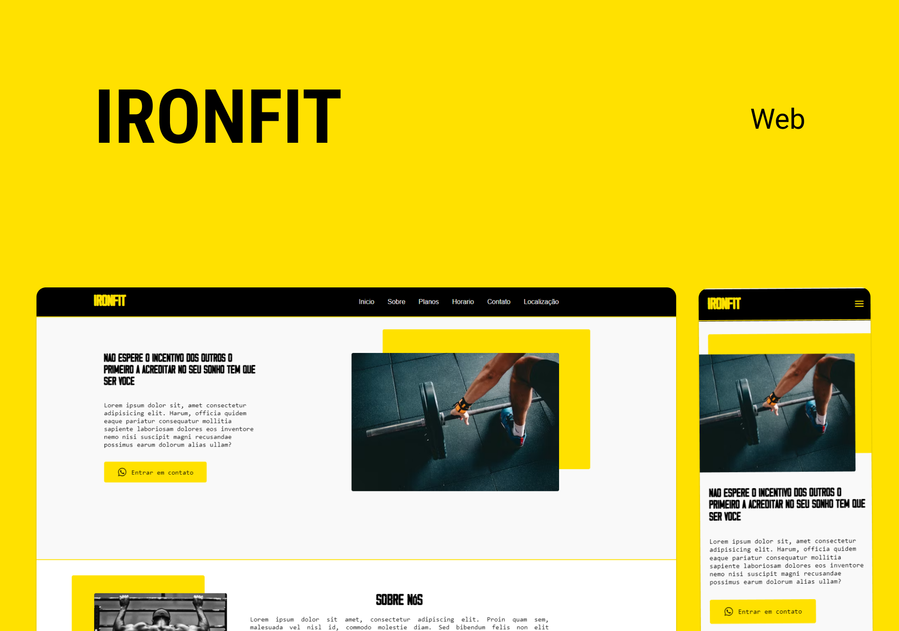

<h1 align="center"> IRONFIT </h1>

Projeto desenvolvido em HTML5, CSS3 e JavaScript, landing page para uma academia 

  

## 🚀 Tecnologias

Esse projeto foi desenvolvido com as seguintes tecnologias:

- HTML e CSS
- JavaScript

## 💻 Projeto

IRONFIT é o layout de uma landing page responsiva e personalizável para uma academia. 

- [Acesse o projeto finalizado, online](https://gabrielrsc.github.io/ironfit/)

---

Feito por Gabriel Robertson.

